## Step 1: Deploy Core Network

**Option A (Terminal):**
Click on the **Terminal button** to open the terminal then from the project root directory, execute the following command:

### Deploy Core Network Components

This command launches all the essential core network components (like AMF, SMF, UPF, NRF, and more) in the background. The `-d` flag means "detached mode" — the containers run silently in the background without cluttering your terminal. Think of it as starting the entire 5G infrastructure engine that powers everything else.

```bash
docker compose -f docker-compose.yml up -d
```

- All core network functions are initialized
- Service ports are exposed and configured
- Network communication channels are established between the functions

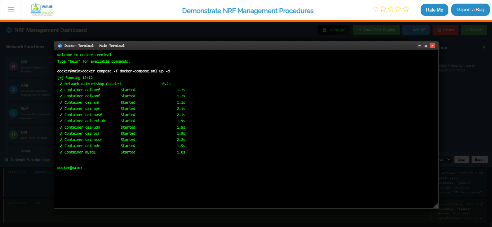

*Fig: Terminal output showing core network deployment with docker compose*

### Deploy gNB (Base Station) Services

Once your core network is humming along, it's time to bring the Base Station (gNB) online. This command spins up the gNB containers and makes them aware of your core network so they can start communicating. Without this, you'd have a network with no base station for devices to connect to!

```bash
 docker compose -f docker-compose-gnb.yml up -d
 ```

- Base station (gNB) is initialized with proper configuration
- gNB registers itself with the NRF (Network Repository Function) — essentially checking in with the core network
- Radio interface is configured and ready to accept UE connections

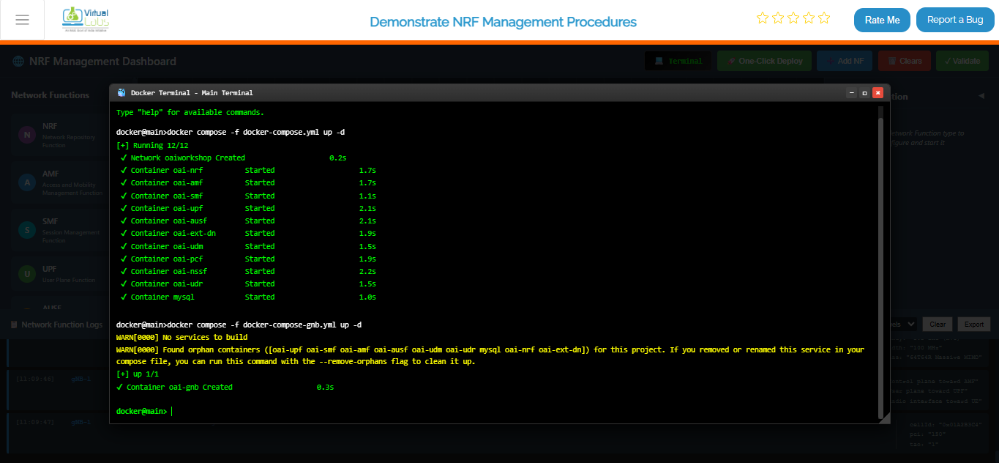

*Fig: Terminal output showing gNB deployment and connection to core network*

### Deploy UE (User Equipment) Services

Now comes the fun part — bringing the end users into the network! This command starts up the UE containers (think of them as the "phones" or "devices" in your 5G network simulation). The UEs will automatically discover and connect to the gNB, just like real phones connecting to a cell tower.

```bash
docker compose -f docker-compose-ue.yml up -d
```

- User Equipment devices are spun up and initialized
- UEs are configured with proper identities (IMSI, etc.)
- UEs automatically search for and connect to the nearby gNB
- Connection negotiation begins with the core network

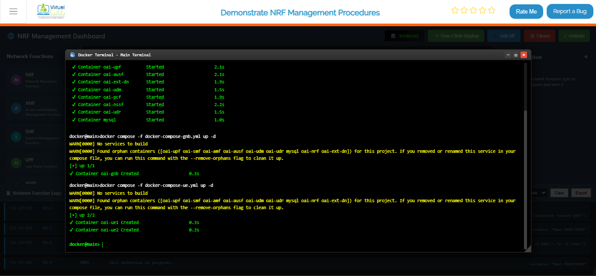

*Fig: Terminal output showing UE deployment and attachment to gNB*

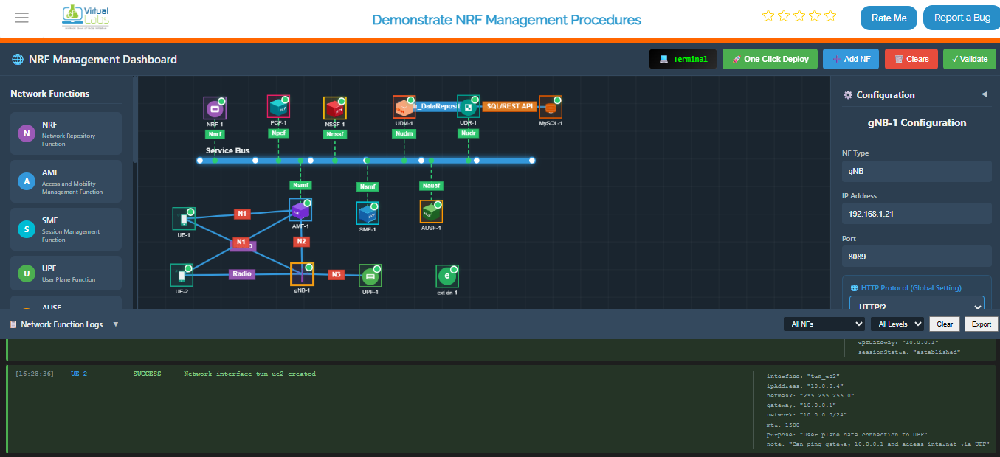

*Fig: Complete 5G network topology with UE, gNB, and all core network functions running*

### View All Running Containers

This command shows you a complete list of all containers that Docker is currently keeping alive — their IDs, status (running, stopped, etc.), ports, and friendly names. It's like asking "Who's home right now?" for your entire 5G network.

```bash
docker ps
```

**What you'll see:**
- A table with all running containers
- Container status (should be "Up" for all deployed components)
- Port mappings showing how containers are exposed
- Each container's unique ID and assigned name

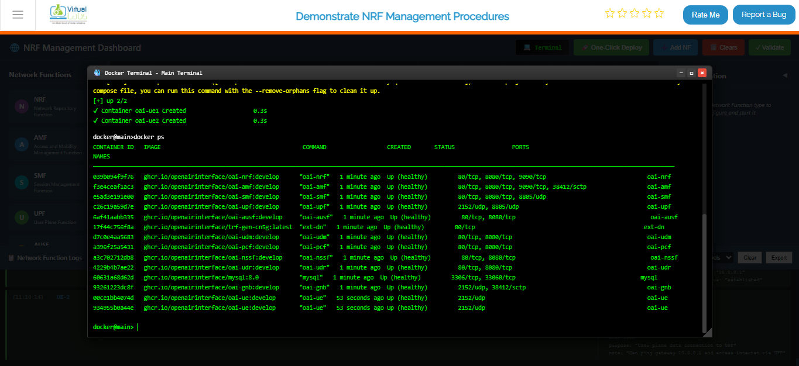

*Fig: Docker PS output listing all running 5G network containers with their status*

### Live Monitoring for Core Network

This is your mission control center! This command sets up a live dashboard that automatically refreshes every 2 seconds, showing you real-time status updates of all your core network containers. Perfect for keeping an eye on things while everything is running — you'll instantly see if anything crashes or changes state without needing to run the command over and over.

```bash
watch docker compose -f docker-compose.yml ps -a
```

**What you're monitoring:**
- Real-time status of all core network components (AMF, SMF, UPF, NRF, etc.)
- Container health and uptime
- Any crashes or restarts happening in real-time
- Resource usage patterns

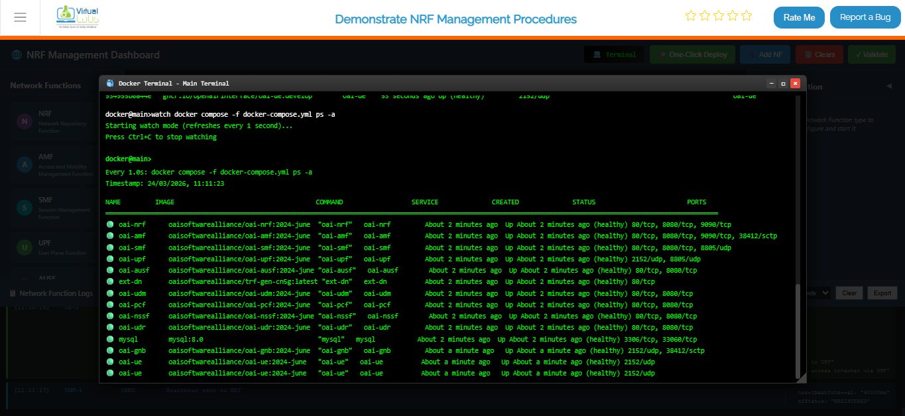

*Fig: Continuous real-time monitoring of core network container status*

## Option B: Manual Deployment

If you want complete control and prefer setting things up one-by-one, this is your option. It's like building with LEGO blocks — you add each piece manually and configure it exactly how you want.

**Steps:**
1. **Add Each Network Function** — Open the Network Function Panel and drag-and-drop each component (AMF, SMF, UPF, etc.) onto your topology canvas one at a time.
2. **Configure the Details** — For each function you add, open the Configuration Panel on the left and fill in the specific settings (IP addresses, ports, identifiers, etc.).
3. **Start Them Up** — Click the "Start" or "Deploy" button for each function individually. Watch as each one comes alive on your topology.
4. **Repeat Until Complete** — Keep adding and configuring functions until your entire 5G network is assembled and all functions show a "Running" status.

**Best for:** Learning the system step-by-step, custom configurations, or troubleshooting specific components individually.

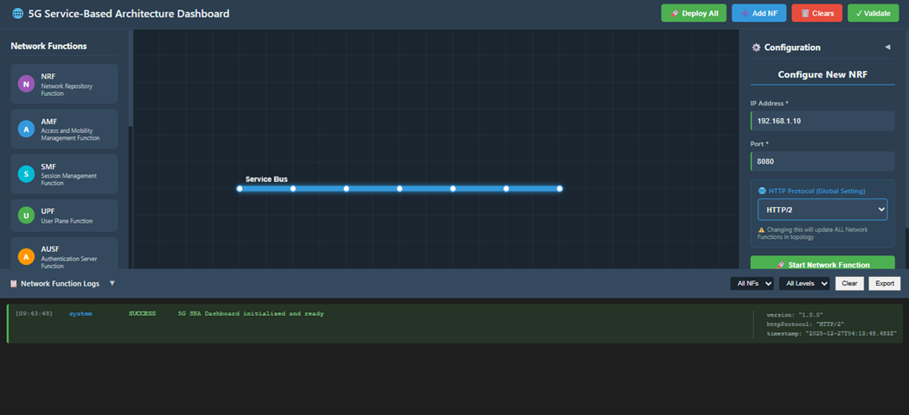

*Fig: Manual Deployment*

---

## Option C: Automatic Deployment (Recommended) 

The "easy button" for deploying your entire 5G network! This is the fastest way to get everything up and running without worrying about the details. Perfect if you just want to see the simulation in action.

**Steps:**
1. **One Click** — Click the **One-Click Deploy** button on the top toolbar. That's it!
2. **Confirm** — A dialog will pop up asking "Are you sure?" Click Confirm, and sit back.
3. **Watch the Magic Happen** — The system takes over from here!

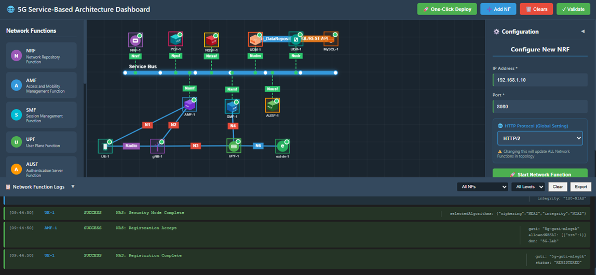

*Fig: Automatic Deployment*

**What happens automatically:**

**The system does all this for you:**
- Clears any existing topology (fresh start)
- Deploys the Service Bus first (the communication backbone)
- Spins up all Network Functions in the right order:
  - NRF (Network Repository Function) — the main registry
  - AMF (Access and Mobility Function) — handles UE connections
  - SMF (Session Management Function) — manages data sessions
  - UPF (User Plane Function) — processes user data
  - AUSF, UDM, PCF, NSSF, UDR — specialized network services
  - MySQL — database for storing network data
  - gNB — the 5G base station
  - UE — user equipment (phones/devices)
  - ext-dn — external data network
- Establishes all necessary connections between functions automatically
- Functions appear one by one on your topology screen like dominoes stacking up
- Waits for everything to stabilize before declaring success


---

## Step 2: Observe Network Function Registration at the NRF

Once everything is deployed, let's peek under the hood and see how network functions introduce themselves to the main registry (NRF). This is like watching your network shake hands and exchange business cards!

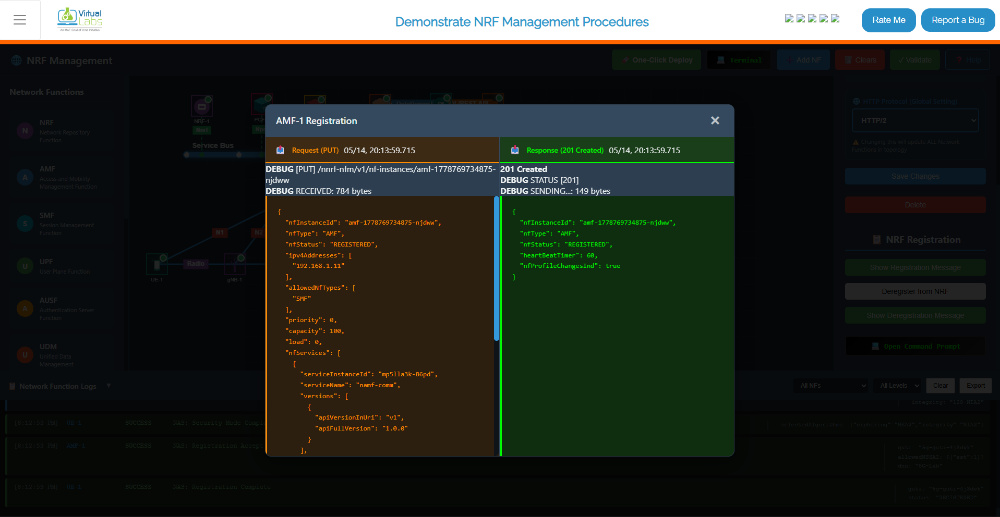

*Fig: Network Function Registration*

**Steps:**
1. **Pick a Function** — Select any Network Function from the topology (try AMF for example).
2. **Open Its Settings** — Look for and click the Configuration Panel on the left side.
3. **See the Handshake** — Click the **Show Registration Message** button to see the conversation between this function and the NRF.

**What you'll observe:**

**The Registration Request** — This is the function saying "Hi NRF! I'm the AMF and here's who I am. Here's my address, capabilities, and how you can reach me."

**The NRF Response** — The NRF replies with "Welcome AMF! I've got you registered. Here's my acknowledgment."

**JSON Format** — Both messages are shown in human-readable JSON, showing all the technical details like:
  - Function type and instance ID
  - IP addresses and ports
  - Capabilities and supported features
  - Timestamps and identifiers

---

## Step 3: View Registration Details from the NRF

Now let's see the same handshake but from the NRF's perspective. The NRF is like a receptionist keeping track of everyone who checks in. Let's see who's on the registry!

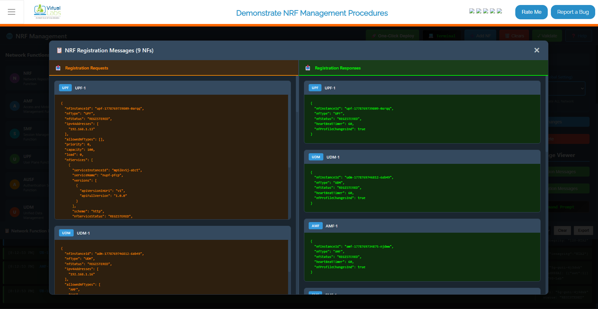

*Fig: NRF Registration Details*

**Steps:**
1. **Find the NRF** — Click on the NRF element in your topology.
2. **Configuration Panel** — Open its Configuration Panel on the left.
3. **See the Full Registry** — Click the **Show Registration Message** button to view all registrations.

**What you'll observe:**

**All Registered Functions** — A complete list of every Network Function that's checked in with the NRF, showing:
  - Which functions are registered
  - Their identification details
  - When they registered
  - Their current status

**Multiple Conversations** — You'll see registration requests from all the functions (AMF, SMF, UPF, gNB, etc.) and the NRF's responses to each one.

**JSON Details** — All the technical metadata formatted in easy-to-read JSON showing exactly what information each function provided during registration.

---

## Step 4: Deregistration of a Network Function

What happens when a network function needs to leave the network? Let's see the process of graceful shutdown — like saying goodbye before you leave the party.

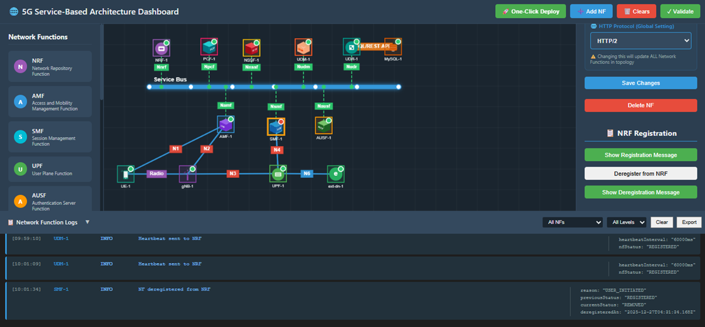

*Fig: Deregistration*

**Steps:**
1. **Choose a Function to Remove** — Select a Network Function you want to deregister (try SMF for example).
2. **Open Configuration** — Click on its Configuration Panel.
3. **Say Goodbye** — Click the **Deregister from NRF** button to tell the registry that this function is shutting down.

**What happens:**

**Clean Shutdown** — The function sends a deregistration message to the NRF.

**Removal Confirmed** — The NRF acknowledges and removes the function from its registry.

**Function is Gone** — The function no longer appears in discovery searches and other functions won't try to contact it.

**Observation:**
- The selected Network Function is successfully deregistered from the NRF.
- It's now offline and unavailable to the rest of the network.

---

## Step 5: Observe Deregistration Messages

### From the Network Function Side

Let's see exactly what the departing function said to the NRF when it left.

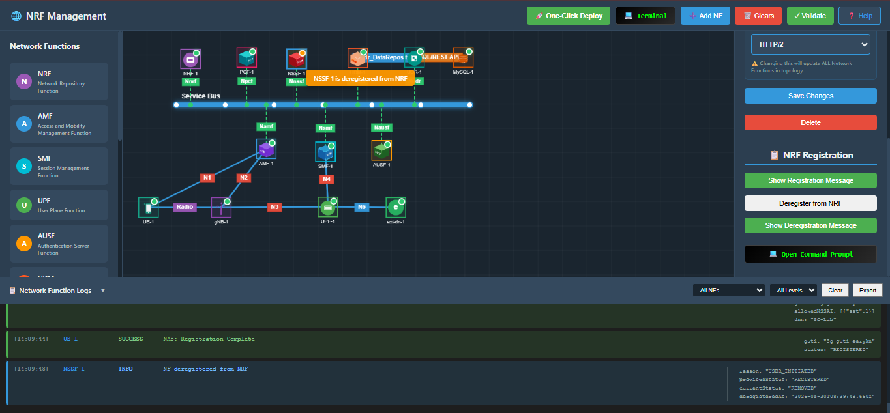

*Fig: Deregistration - NF Side*

**Steps:**
1. **Select the Deregistered Function** — Click on the function that just deregistered.
2. **Open Configuration** — Access its Configuration Panel.
3. **See the Farewell** — Click **Show Deregistration Message** to see their goodbye conversation.

**What you'll see:**

**The Function's Farewell** — The message it sent to NRF saying "I'm shutting down, please remove me from the registry."

**The NRF's Acknowledgment** — The NRF's response: "Got it, you're removed. Goodbye!"

**Full Technical Details** — All conversations shown in JSON format with timestamps and identifiers.

### From the NRF Side

Now let's check the same event from the NRF's viewpoint — the administrative record of who checked out.

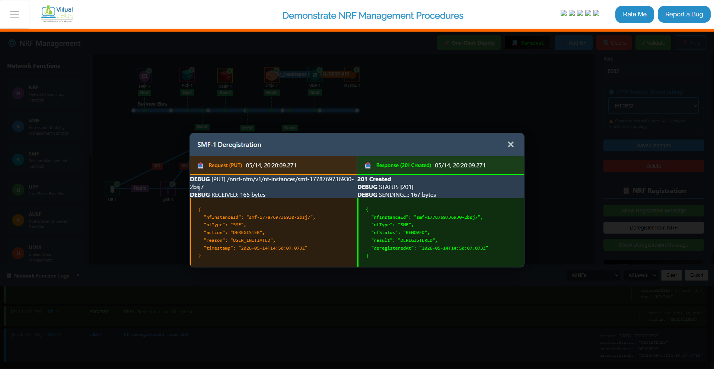

*Fig: Deregistration - NRF Side*

**Steps:**
1. **Select the NRF** — Click on the NRF in your topology.
2. **Configuration Panel** — Open its Configuration Panel.
3. **See the Admin Record** — Click **Show Deregistration Message** to view the deregistration from the NRF's perspective.

**What you'll see:**

**Deregistration Log** — The NRF's administrative record showing:
  - Which Network Function sent the deregistration request
  - The exact timestamp of when it happened
  - The function's identification details
  - The NRF's processing and confirmation

**Clean Removal** — Evidence that the function has been successfully removed from the registry and won't appear in any future discovery searches.

**Technical Details** — All information presented in JSON format for technical analysis.

---

## Step 6: Network Function Discovery After Deregistration

Final proof that deregistration worked! When other network functions try to find the deregistered function, they'll get an empty response. Let's verify this.

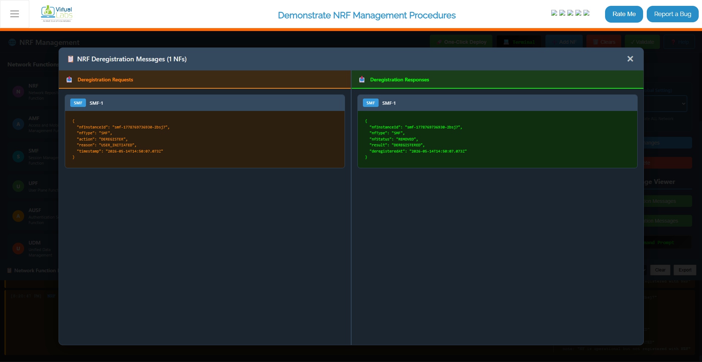

*Fig: Network Function Discovery*

**What's Happening:**

When a Network Function is deregistered, the NRF immediately verifies its removal whenever discovery requests come in. It's like removing someone from a business directory — they won't show up in any lookups anymore.

**Key Points:**

**Discovery Requests Fail** — If any other function tries to discover the deregistered function by name or type, the NRF responds with "Not found."

**No Results** — Deregistered Network Functions are completely absent from any discovery results.

**Verification** — Discovery-related logs can be checked to confirm that:
  - The deregistered function doesn't appear in any discovery responses
  - Other functions receive "not available" responses when attempting to locate it
  - The function has been completely removed from the network registry

**Confirmation** — This proves the deregistration was successful and complete.