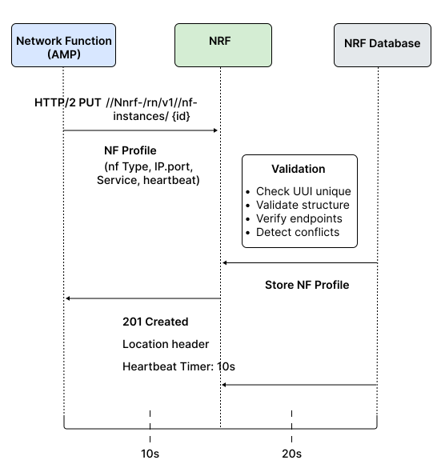
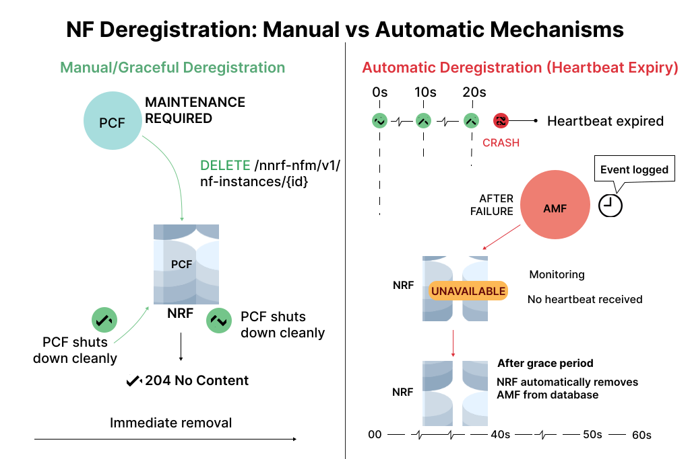
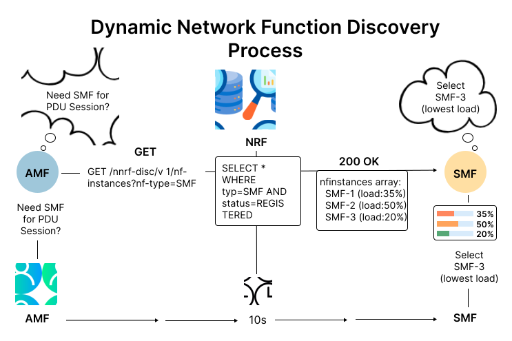

## 1. Network Repository Function (NRF)

### What is NRF?
The NRF acts as the central directory or information hub of the entire 5G Core Network. It maintains a complete registry of all active Network Functions and their capabilities.

### Information Stored by NRF:
* NF Identity and NF Type (AMF, SMF, PCF, UDM, AUSF, etc.)
* Instance ID (UUID) - Globally unique identifier
* IPv4/IPv6 addresses and Port numbers
* Supported services and API versions
* Heartbeat timer value
* Operational status (REGISTERED / UNAVAILABLE)


*Fig 1: NRF Central Registry Architecture*

### Why NRF is Critical:
Without NRF, each NF would need manual configuration with addresses of every other NF, which is impossible in cloud-native 5G systems where NFs:
* Scale up or down dynamically
* Restart due to failures
* Relocate across cloud nodes
* Launch multiple instances based on load

The NRF makes 5G Core flexible, dynamic, self-adapting, intelligent, and easy to scale.


<details>
<summary><strong>2. Network Function Registration</strong></summary>

## 2. Network Function Registration

Registration is the first and most essential procedure when any Network Function becomes operational. The NF must announce its availability to the NRF so other NFs can discover and communicate with it.

### Registration Process:

**Step 1: NF Sends Registration Request**
* HTTP Method: PUT
* Endpoint: /nnrf-nfm/v1/nf-instances/{nfInstanceId}
* Protocol: HTTP/2 over TCP
* Content Type: JSON

**Step 2: NF Profile (JSON Payload)**

The request contains a detailed NF Profile with the following fields:

| Field | Description | Example |
|-------|-------------|---------|
| nfInstanceId | Unique UUID for this NF instance | 4947a69a-f61b-4bc1-b9da-47c9c5d14b64 |
| nfType | Type of Network Function | AMF, SMF, PCF, UDM, AUSF |
| nfStatus | Current operational state | REGISTERED |
| ipv4Addresses | IP address of the NF | 127.0.0.5 [NF_ip_address] |
| port | Service port number | 7777, 8080 |
| nfServices | List of supported services/APIs | namf-comm, nsmf-pdusession |
| allowedNfTypes | Which NFs can consume this service | [SMF, UDM] |
| heartBeatTimer | Periodic check interval (seconds) | 10 |
| capacity | Load handling capability | 100 |
| priority | Selection priority | 1 |

**Step 3: NRF Validation**

When NRF receives the registration request, it:
1. Checks if nfInstanceId is unique - Rejects if duplicate exists
2. Validates NF profile structure - Ensures all mandatory fields are present
3. Verifies service endpoint information - Checks IP/port validity
4. Detects conflicts - Identifies any inconsistencies

**Step 4: NRF Response**
* Success Response: 201 Created 
  * NRF stores the profile in its internal repository
  * Returns Location header indicating where profile is stored
  * Confirms heartbeat timer value
* Failure Response: 400 Bad Request or other error codes 
  * Registration rejected due to invalid data or conflicts



*Fig 2: NF Registration Complete Flow*

### Example: AMF Registration

**Key Registration Details:**
* NF Type: AMF (Access and Mobility Management Function)
* Status: REGISTERED
* IP Address: 192.168.70.135
* Supported Service: namf-comm (Communication service)
* Allowed NF Types: SMF (Session Management can use AMF services)
* Heartbeat Timer: 10 seconds

**What Happens:**
1. AMF starts and prepares its NF profile
2. Sends PUT request to NRF with instance ID, service list, API versions, endpoints
3. NRF processes and validates the request
4. NRF responds with 201 Created and assigns heartbeat timer
5. AMF must now send periodic heartbeats every 10 seconds to stay active

### Example: UDM Registration

**Key Registration Details:**
* NF Type: UDM (Unified Data Management)
* Multiple Services Registered: 
  * nudm-ueau (User Authentication)
  * nudm-uecm (UE Context Management)
  * nudm-sdm (Subscription Data Management)

**What Happens:**
1. UDM has a richer profile since it provides multiple services
2. Sends large JSON payload describing every service instance
3. Includes API version, network address, supported consumers for each service
4. NRF accepts registration and responds with 201 Created
5. Now AMF, SMF, and AUSF can discover UDM services when needed

</details>

<details>
<summary><strong>3. Network Function Discovery</strong></summary>

## 3. Network Function Discovery

### What is Discovery?
Discovery is the mechanism that allows NFs to find and connect with other NFs dynamically without manual configuration. It works like a search operation in a service directory.

### Discovery Process:

**Step 1: NF Needs Another Service**

Example Scenario:
* AMF needs to establish a PDU session for a user
* Must contact Session Management Function (SMF)
* But 5G Core is dynamic - multiple SMF instances may be running
* AMF doesn't know their IP addresses or locations

**Step 2: NF Sends Discovery Request**
* HTTP Method: GET
* Endpoint: /nnrf-disc/v1/nf-instances?nf-type=SMF
* Query Parameters: 
  * nf-type - Type of NF needed (SMF, PCF, UDM, etc.)
  * service-names - Specific service required
  * target-nf-instance-id - If looking for specific instance
  * requester-nf-instance-id - Who is requesting

**Step 3: NRF Searches Internal Database**

NRF queries its registry for:
* All NFs matching the requested type
* Currently REGISTERED status
* Services matching the requirement
* Compatible API versions

**Step 4: NRF Returns Discovery Response**

Success Response: 200 OK with JSON array containing:

```json
{
  "nfInstances": [
    {
      "nfInstanceId": "uuid-smf-1",
      "nfType": "SMF",
      "nfStatus": "REGISTERED",
      "ipv4Addresses": ["192.168.1.10"],
      "nfServices": [{
        "serviceInstanceId": "service-1",
        "serviceName": "nsmf-pdusession",
        "versions": [{"apiVersionInUri": "v1"}],
        "scheme": "http",
        "fqdn": "smf1.5gc.mnc001.mcc001.3gppnetwork.org",
        "ipEndPoints": [{
          "ipv4Address": "192.168.1.10",
          "port": 8080
        }]
      }],
      "capacity": 100,
      "load": 35,
      "priority": 1
    }
  ]
}
```

Each discovered NF includes:
* IP addresses and service endpoints
* NF instance IDs - For direct communication
* Version compatibility - API version information
* Availability status - REGISTERED/UNAVAILABLE
* Capacity and load - For load balancing decisions
* Priority - For selection preference



*Fig 3: NF Discovery Process*

### Why Discovery is Important:
* Removes manual configuration - No hardcoded IP addresses needed
* Supports dynamic environments - New instances appear/disappear automatically
* Enables load balancing - NRF returns multiple instances with load info
* Ensures connectivity - Always connects to active, available NFs
* Version compatibility - Finds NFs with compatible API versions

</details>

<details>
<summary><strong>4. Network Function Deregistration</strong></summary>

## 4. Network Function Deregistration

### What is Deregistration?
Deregistration is the final step in the lifecycle of any Network Function. It removes the NF from the NRF registry when the NF is no longer available.

### When Deregistration Happens:
* NF is being stopped for maintenance
* NF is being replaced with new version
* NF is being scaled down (reduced instances)
* NF is being relocated to different server
* NF is shutting down gracefully

### Type 1: Manual/Graceful Deregistration

**Process:**
1. NF Sends Deregistration Request 
   * HTTP Method: DELETE
   * Endpoint: /nnrf-nfm/v1/nf-instances/{nfInstanceId}
   * Contains the specific NF instance ID to remove
2. NRF Processes Request 
   * Locates the NF profile in registry
   * Validates the deregistration request
   * Removes the NF profile from database
3. NRF Response: 
   * Success: 204 No Content - Profile deleted successfully
   * Error: 404 Not Found - NF instance doesn't exist

**Why Manual Deregistration Matters:**
* Ensures clean shutdown - Other NFs immediately know this NF is offline
* Prevents failed connections - No other NF will try to contact removed service
* Maintains registry accuracy - Database stays current and reliable
* Avoids timeout delays - Immediate removal instead of waiting for heartbeat expiry

### Type 2: Automatic Deregistration (Heartbeat-Based)

**The Problem:** NFs may crash unexpectedly due to:
* Software failures or bugs
* Network errors or disconnection
* Power failure or hardware issues
* Container shutdown or orchestration events
* Operating system crashes

In these cases, the NF cannot send a DELETE request.

**The Solution: Heartbeat Mechanism**

**How It Works:**
1. During Registration: 
   * NRF assigns a heartbeat timer (e.g., 10 seconds)
   * NF must send periodic heartbeat updates before timer expires
2. Heartbeat Update: 
   * HTTP Method: PUT or PATCH
   * Endpoint: /nnrf-nfm/v1/nf-instances/{nfInstanceId}
   * Minimal payload - just confirms "I'm still alive"
   * Resets the heartbeat timer
3. Heartbeat Monitoring: 
   * NRF tracks last heartbeat time for each NF
   * If no heartbeat received within timer period: 
     * NRF marks NF status as "UNAVAILABLE"
     * After additional grace period, NRF removes the profile
     * Prevents stale records in database
4. Automatic Cleanup: 
   * NRF runs periodic cleanup tasks
   * Identifies expired NF instances
   * Removes them from registry automatically
   * Logs the removal event



*Fig 4: Deregistration Types - Manual vs Automatic*

**Benefits of Heartbeat Mechanism:**
* Self-healing registry - Automatically removes dead NFs
* No manual intervention - System maintains itself
* Prevents connection failures - Discovery won't return dead NFs
* Handles edge cases - Works even when NF crashes unexpectedly

</details> 