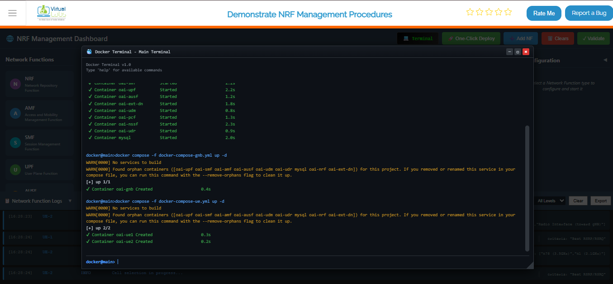
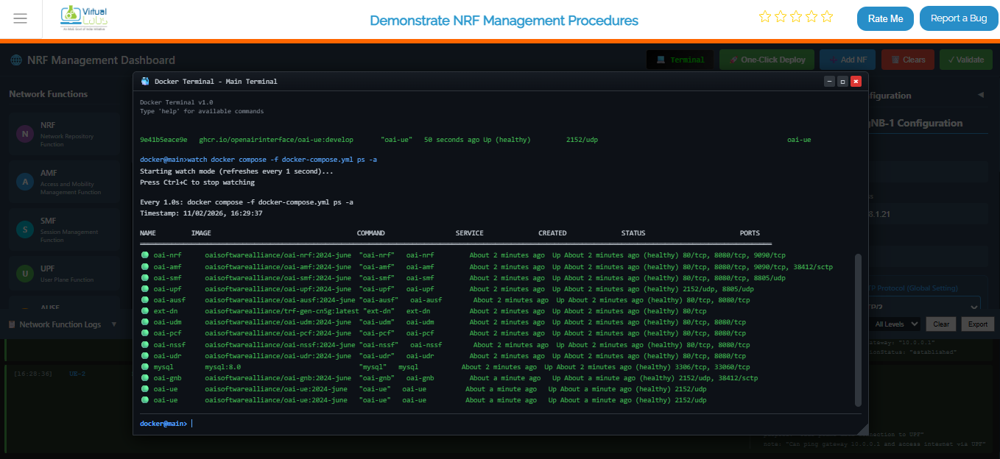
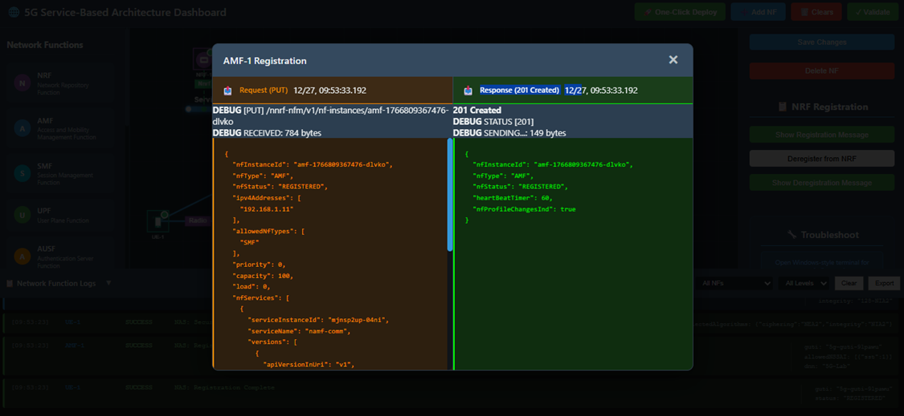
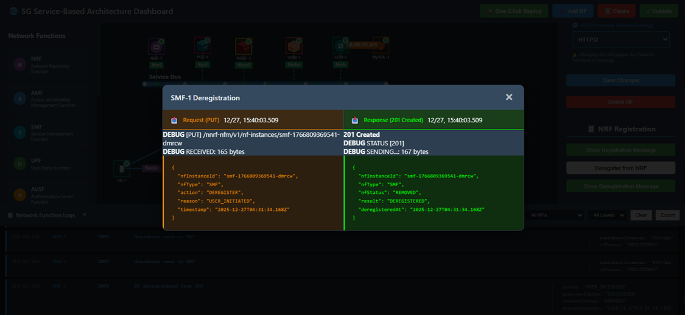
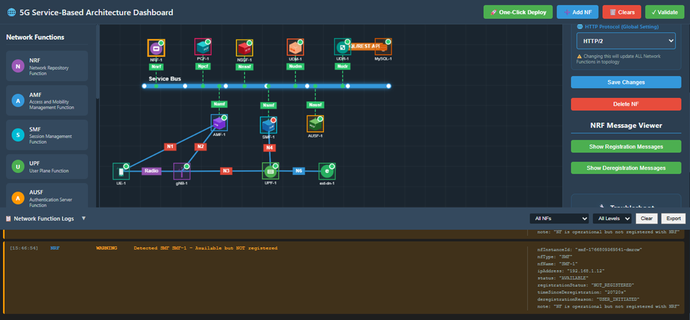

## Step 1: Deploy Core Network

**Option A (Terminal):**
Click on the **Terminal button** to open the terminal then from the project root directory, execute the following command:


This command starts all core network components (AMF, SMF, UPF, NRF, etc.) in detached mode

```bash
docker compose -f docker-compose.yml up -d
```


# Once the core network is up and running, deploy the gNB services:

```bash
 docker compose -f docker-compose-gnb.yml up -d
 ```
This command initializes the gNB and establishes connectivity with the core network.


# After the gNB deployment is complete, deploy the UE services:


```bash
docker compose -f docker-compose-ue.yml up -d
```
This starts the UE containers and attaches them to the gNB.




# To verify that all containers are running successfully, execute:

```bash
docker ps
```


# To continuously monitor the status of the core network containers, use:

```bash
watch docker compose -f docker-compose.yml ps -a
```



### Option B: Manual Deployment

1. Manually add each Network Function from the Network Function Panel.
2. Enter the required configuration details in the left Configuration Panel.
3. Start each Network Function individually.
4. Repeat the process until all required Network Functions are deployed and running.


*Fig: Manual Deployment*

---

### Option C: Automatic Deployment (Recommended)

1. Click the **One-Click Deploy** button on the top toolbar.
2. Confirm the deployment when prompted.


*Fig: Automatic Deployment*

**Observation:**

- The system automatically clears any existing topology.
- The Service Bus is deployed first.
- All Network Functions (NRF, AMF, SMF, UPF, AUSF, UDM, PCF, NSSF, UDR, MySQL, gNB, UE, and ext-dn) are deployed sequentially.
- Required interconnections are established automatically.
- Network Functions appear one by one on the topology view during deployment.

---

## Step 2: Observe Network Function Registration at the NRF



*Fig: Network Function Registration*

1. After deployment, select a Network Function (e.g., AMF) from the topology.
2. Open its Configuration Panel.
3. Click the **Show Registration Message** button.

**Observation:**

- The Network Function Registration Request sent to the NRF is displayed.
- The corresponding NRF Registration Response is also shown.
- All messages are displayed in JSON format.

---

## Step 3: View Registration Details from the NRF


*Fig: NRF Registration Details*

1. Select the NRF from the topology.
2. Open the Configuration Panel.
3. Click **Show Registration Message**.

**Observation:**

- Registration requests received from all Network Functions are displayed.
- Corresponding NRF responses are shown in JSON format.

---

## Step 4: Deregistration of a Network Function


*Fig: Deregistration*

1. Select a Network Function (e.g., SMF) from the topology.
2. Open its Configuration Panel.
3. Click the **Deregister from NRF** button.

**Observation:**

- The selected Network Function is successfully deregistered from the NRF.

---

## Step 5: Observe Deregistration Messages

### From the Network Function Side



*Fig: Deregistration - NF Side*

1. Select the deregistered Network Function.
2. Open the Configuration Panel.
3. Click **Show Deregistration Message**.

**Observation:**

- The deregistration request and the NRF response are displayed in JSON format.

### From the NRF Side


*Fig: Deregistration - NRF Side*

1. Select the NRF from the topology.
2. Open the Configuration Panel.
3. Click **Show Deregistration Message**.

**Observation:**

- The NRF displays which Network Function requested deregistration.
- Corresponding deregistration details are shown in JSON format.

---

## Step 6: Network Function Discovery After Deregistration



*Fig: Network Function Discovery*

When a Network Function is deregistered, the NRF verifies its availability during discovery requests.

Deregistered Network Functions are no longer returned in discovery results.

**Observation:**

- Discovery-related logs can be viewed to confirm that the deregistered Network Function is unavailable.